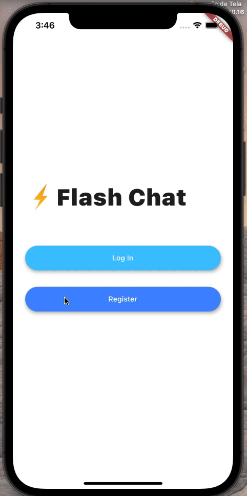

# Flash Chat

## Goal
An exercise to how incorporate Firabase on projects, using Firebase Cloud Firestore as well as the Firebase authentication package to equip the app with a cloud based NoSQL database and secure authentication methods.

## The App
An modern messaging app.

## Features
- Firebase integration;
- Firebase authentication to register and sign in users;
- Animations using the Flutter Hero widget;
- Custom aniamtions using Flutter's animation controller.
